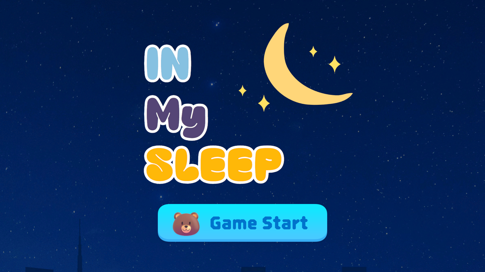
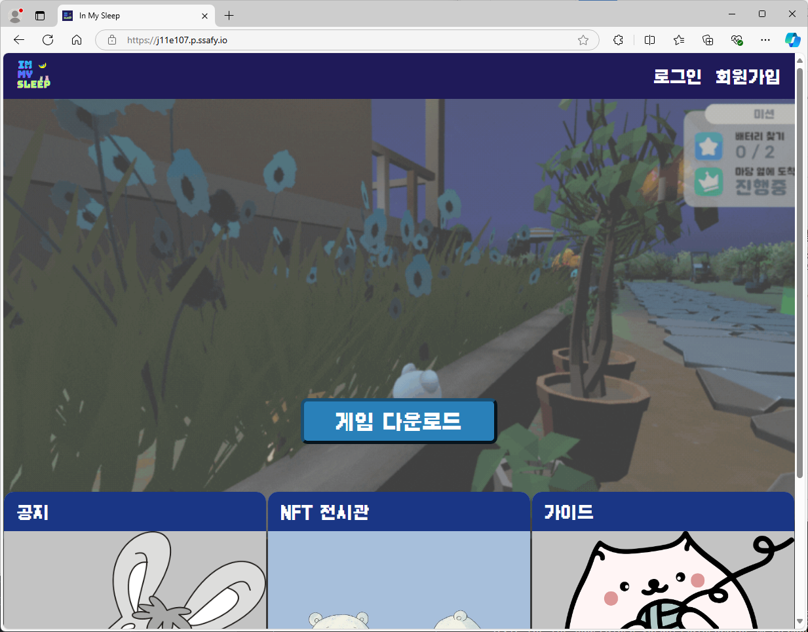
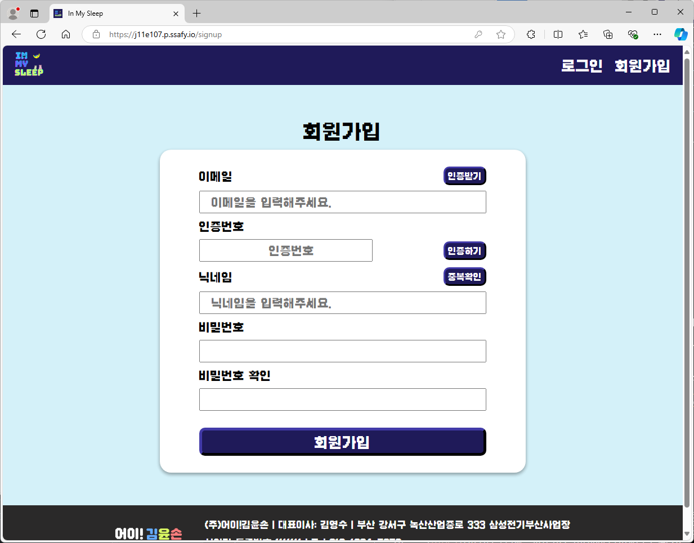
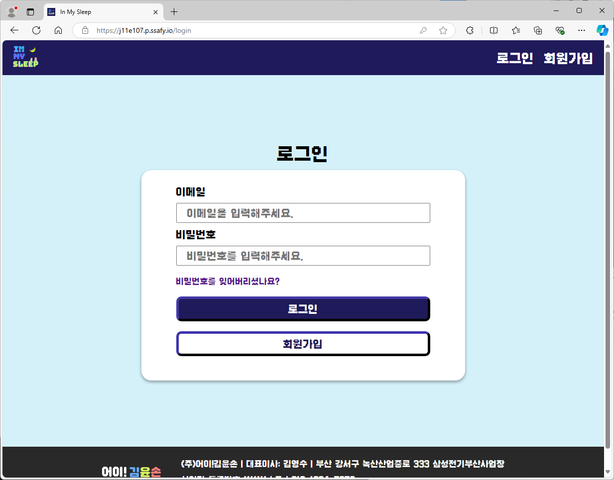
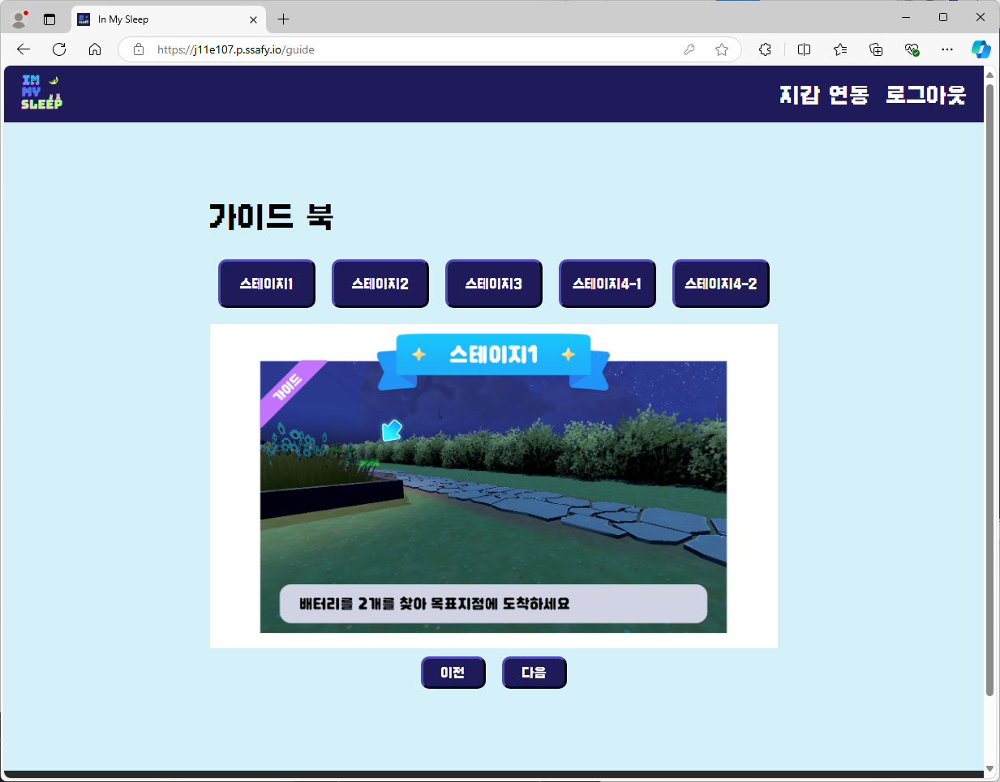
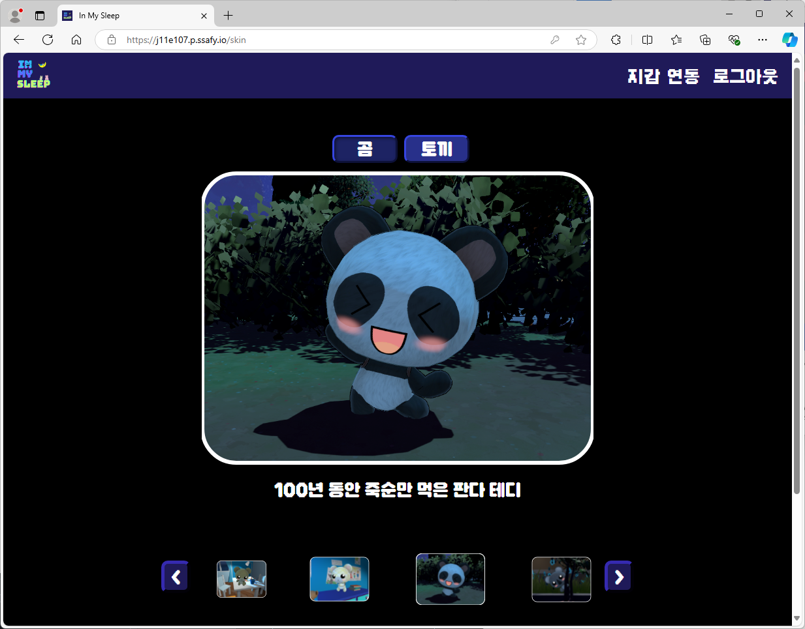
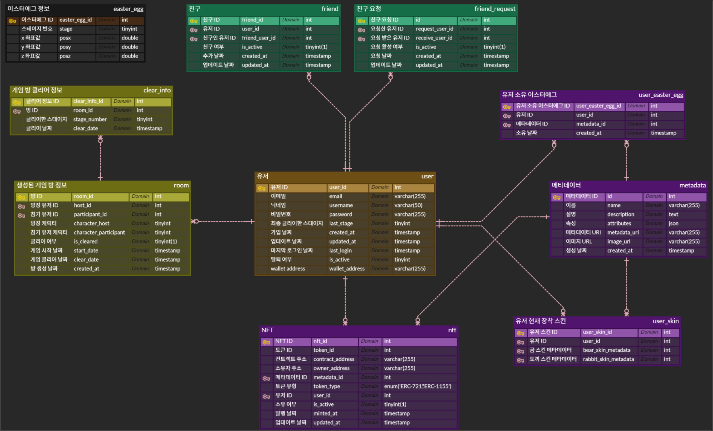

#  🎮**In My Sleep**

 

## 🕹️ 개요

팀명: **어이! 김윤손**  
 서비스명: **In My Sleep**  
 개발기간: **2024년 8월 19일 ~ 10월 11일 (8주)**

 

## 🐻 어이! 김윤손 - 팀원 소개 🐰

|  |  |  |          |                                                           |  |
|:--------------------------------------------------------------------:| :--------------------------------------------------------------------:|:---------------------------------------------------------------------:|:---------------------------------------------------------------------:|:---------------------------------------------------------------------:|:---------------------------------------------------------------------:|
|                                 김영수                                 |                                  김종덕                                  |                                 손원륜                                  |                                     어지민                                     |                                                             윤지호                                                             |                                  이준수                                  |
|                     팀장 Game Client                     |                          Game Client                          |                               Game Client                               |                                  Game Client Frontend                                   |                                                Game Client CI/CD Backend                                                |                               Game Client BlockChain                                |
|  Photon Network 연결 및 동기화 플레이어 및 기타 로직 구현 게임 통합 개발 및 빌드  |      보스 패턴 설계 및 구현 맵 설계 및 구현       |           달리기 맵 구조 설계 및 구현 맵 설계 및 구현           | 웹 페이지 제작 UI/UX 설계 및 구현 인 게임 UI 설계 및 구현 컷신 및 가이드 제작 | 인프라  및 CI/CD 구축 API 및 DB 설계 설정 메뉴 구현 개 패턴 구현 |              스마트 컨택스트 작성 NFT, 스킨 백엔드 설계 및 구현 인 게임 이스터에그 구현               |

 
 

## 🔋 서비스 소개

## 고양이가 던진 자명종 배터리를 찾아 떠나는 대모험
장난감들의 주인인 안나가 자고 있을 때, 고양이가 자명종의 배터리를 훔쳐 멀리 던져버렸습니다! 
이제 토끼와 곰이 힘을 합쳐 잃어버린 배터리를 되찾고, 다시 자명종을 울려야 합니다. 
각기 다른 능력을 가진 두 친구와 함께 위험천만한 스테이지들을 통과하고, 아슬아슬한 모험을 즐겨보세요!

 

## 3D 멀티플레이 2인 협동 게임
혼자서는 해결할 수 없습니다! 이 게임은 2명이 함께 힘을 합쳐 플레이하는 협력 게임입니다. 
곰의 힘과 토끼의 민첩함을 활용해 각 스테이지의 독특한 퍼즐과 도전을 풀어나가세요. 
둘만의 완벽한 팀워크가 승리의 열쇠입니다.

 

## 스테이지마다 색다른 기믹과 도전!
매 스테이지 다양한 기믹이 등장합니다! 
개에게 들키지 않고 몰래 움직여야 하는 긴장감 넘치는 잠입 미션부터, 뒤에서 쫓아오는 거대 로봇 청소기와의 아슬아슬한 도주극까지! 그리고 거대한 고양이 보스와의 숨 막히는 전투까지 기다리고 있습니다. 
모든 스테이지를 클리어해야 자명종을 되찾을 수 있습니다.

 

## 이스터에그 발견과 인게임 스킨 획득
각 스테이지에 숨겨진 이스터에그를 발견하면 게임 내에서 적용할 수 있는 스킨이 제공됩니다.
오직! 하나의 스테이지에만 등장하기 때문에 게임을 플레이하며 주변을 잘 살펴야합니다. 이스터에그를 획득하고 게임을 클리어하여 귀엽고 사랑스러운 스킨을 적용시켜보세요!

 

## 마음에 드는 스킨을 NFT로 발행하고 보관
혹시 스킨 중에 마음에 들어서 간직하고 싶은 스킨이 있나요? MetaMask 지갑을 연동하면 NFT로 발행할 수 있어요! 예쁜 스킨을 NFT로 발행해서 소유권을 증명하고 나만의 지갑에 보관하세요.

 

## 🐶 주요 기능

|                                                  |                                         |
| ------------------------------------------------ | -------------------------------------------------- |
|  |  |
| `웹 페이지` 웹 페이지 메인 화면 | `게임 다운로드` 웹 페이지 게임 다운로드 |
|  |  |
| `회원가입` 회원가입 페이지 | `로그인` 로그인 페이지 |
|  |  |
| `가이드` 가이드 페이지 | `NFT` NFT 스킨 페이지 |
|  |  |
| `메인 화면` 게임 메인 화면 | `로그인 화면` 로그인 화면 |
|  |  |
| `로비 화면` 게임 입장시 메인 로비 화면 | `게임 화면` 게임 입장시 화면 |

 

## ⚙️ 사용 기술

### **FE**

### **BE**

### **Block Chain**

### **INFRA**

 

### **모니터링**

### **Game**

### **협업**

 
 

## 🛠️ 서비스 아키텍쳐

 

 

## 🗄️ ERD

 
 

## 📒 프로젝트 기록

[Notion 협업링크](https://fanatical-calendula-c14.notion.site/d176a2b5fe0a4187844946738e4f7c92?v=df6606e6f693460996b4a8685dab77e24)

## 🎨 와이어 프레임

[Figma 링크](https://www.figma.com/design/BMOvdKcM3o4la1leCPI5AK/%ED%8A%B9%ED%99%94-%ED%94%84%EB%A1%9C%EC%A0%9D%ED%8A%B8?node-id=0-1&node-type=canvas)