# 🎮 In My Sleep 포팅 매뉴얼

## Unity

### Version

- **게임 엔진**: Unity `2022.3.42f1`
- **실시간 통신**: PUN `2.47`, Photon Chat `2.17`

### 실행 방법

- 유니티 Editor에서 빌드
    - 기본 설정되어 있는 씬을 그대로 빌드

## 인프라

- **웹 서버**: Nginx
- **가상화** : Docker
- **CI/CD** : Jenkins

## Back-end

### Version

- **런타임 환경**: `Java 17.0.12`
- **프레임워크**: SpringBoot
- **DB 모델링**
    - **ORM 라이브러리**: JPA (Hibernate)
    - **Dialect**: MySQL 8.0.37
- **캐싱**: Redis 7.4.0

### 실행 방법
프로젝트에 .env 파일 설정 후 Spring 프로젝트 실행
```env
# .env 파일
# MySQL 설정
DB_URL=jdbc:mysql:/DBURL:3306/e107?serverTimezone=Asia/Seoul&characterEncoding=UTF-8
DB_USERNAME=
DB_PASSWORD=

# 이메일 정보 SMTP
EMAIL_USERNAME=
EMAIL_PASSWORD=

# Redis 설정
REDIS_HOST=
REDIS_PORT=6379
REDIS_PASSWORD=
```

## DB
`/dump` 디렉터리 참조
- **게임 데이터 DB**: MySQL
- **이메일 인증 DB**: Redis

## Front-end

### Version

- **런타임 환경:** Node.js `20.17.0`
- **프레임워크**: Vue.js `3.4.29`

### 실행 방법

```terminal
npm install
npm run build
```

## Blockchain

### Version

- Express.js: `4.20.0`
- ethers: `6.13.2`
- web3: `4.12.1`
- MetaMask
- Polygon
- Truffle `5.11.5`
- IPFS `0.30.0`

### Express.js 실행
```
# Server
PORT=
SSL_KEY=
SSL_CERT=
SSL_CHAIN=
# Database
DB_HOST=
DB_USER=
DB_PASSWORD=
DB_NAME=
# Blockchain
WEB3_PROVIDER=
CONTRACT_ADDRESS=
PRIVATE_KEY=
# Wallet
JWT_SECRET=
```
```
npm i
npm run dev
```

### Truffle 배포 방법
- docker-compose-nodejs.yml 파일 실행
```
docker compose -f docker-compose-nodejs.yml up -d
docker exec -it ubuntu-node-1 /bin/sh
npm i -g truffle
```
- 스마트 컨트랙트 배포
```
truffle compile
truffle migrate --network <Network Name>
```

### IPFS 구성
- CORS 설정 파일 구성
- docker-compose-ipfs.yml 파일 실행
```
docker compose -f docker-compose-ipfe.yml up -d
```
- images에 이미지 파일 추가 후 upload_image.sh 스크립트 실행
- metadatas에 메타데이터 파일 추가 후 upload_metadata.sh 스크립트 실행

## Photon Server Setting

1. https://www.photonengine.com/
2. 로그인 후 Create New Application
3. Multiplayer Game을 선택하고 프로젝트 생성 AppId 복사
4. 유니티 -> 포톤 유니티 네트워킹 -> PUN Wizard -> Setup Project -> 복사한 AppId 입력 후 Setup Project

## 시연 시나리오

1. 게임시작화면


2. 로그인화면


3. 로비 화면
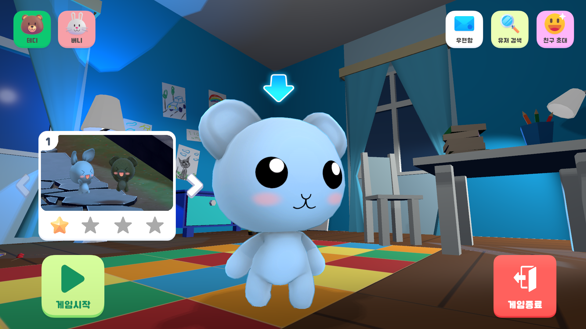


4. 친구 요청 및 수락
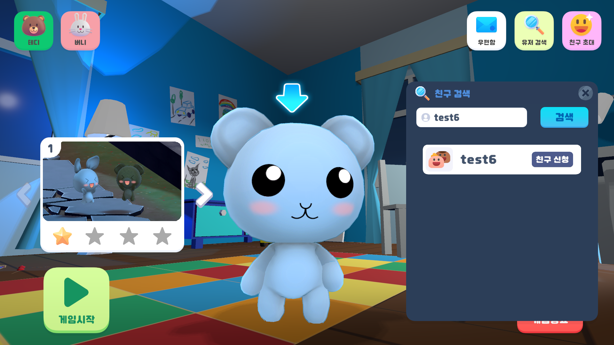
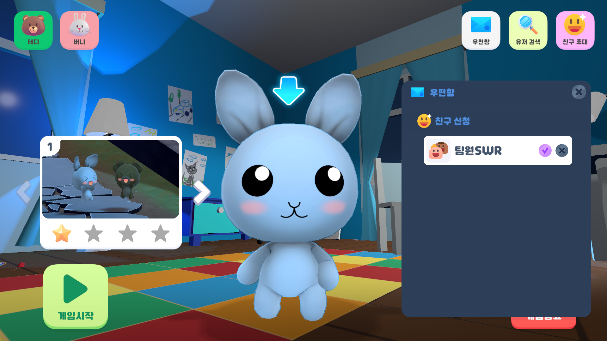


5. 친구 초대 및 게임 시작
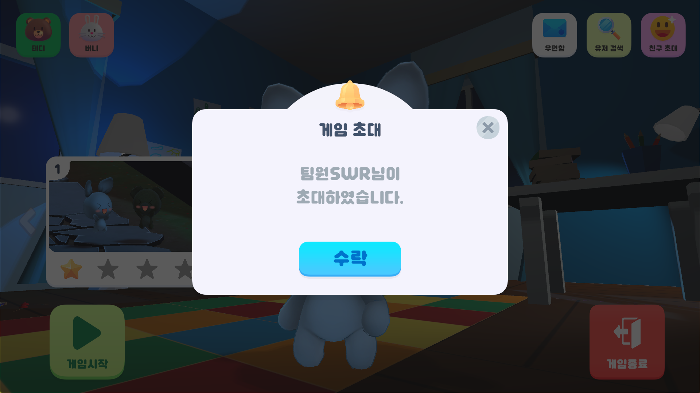
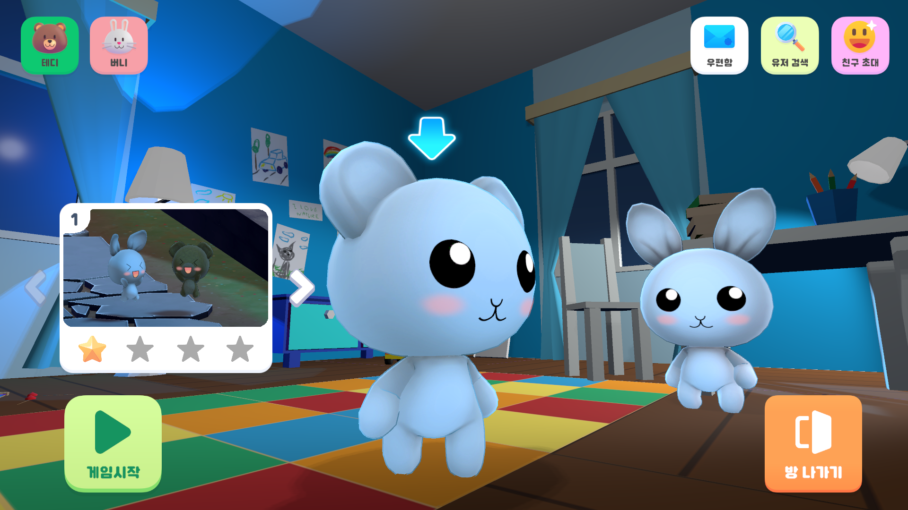


6. 스테이지 진행 방식
   1. 스테이지 스토리
   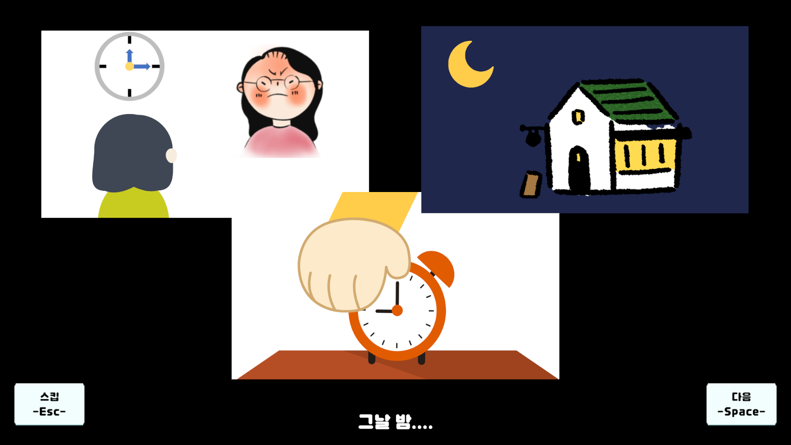

   2. 스테이지 가이드
   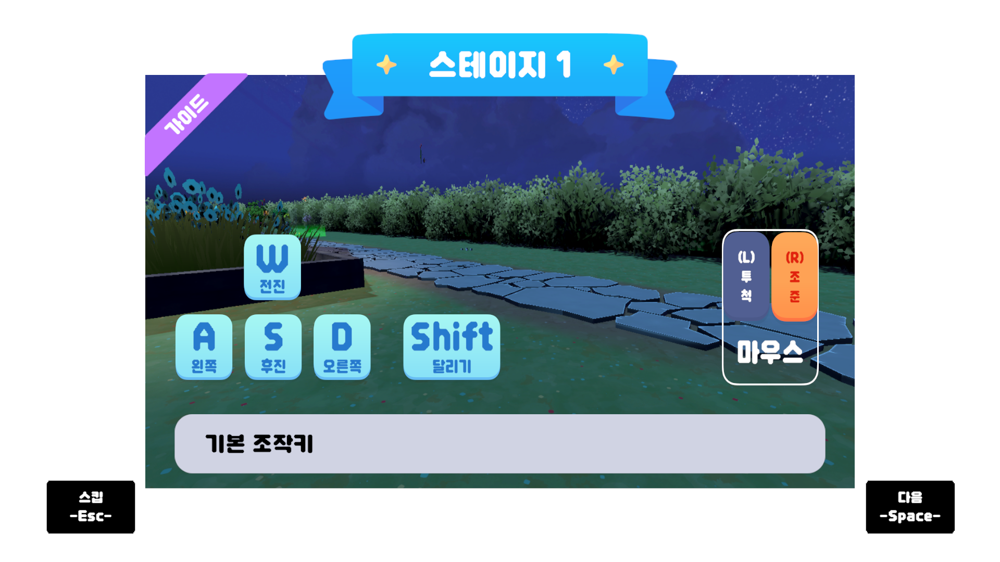

   3. 인게임
   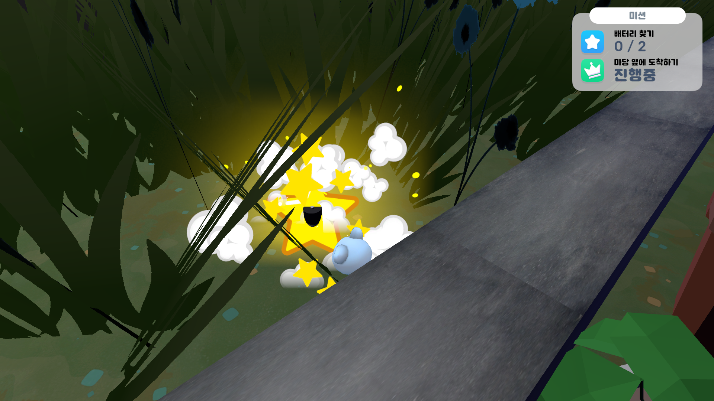
   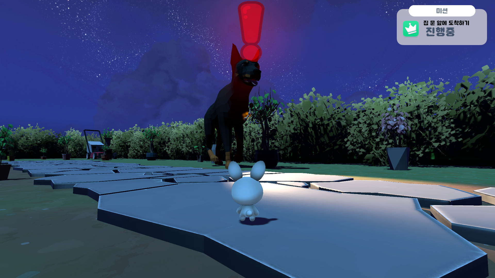
   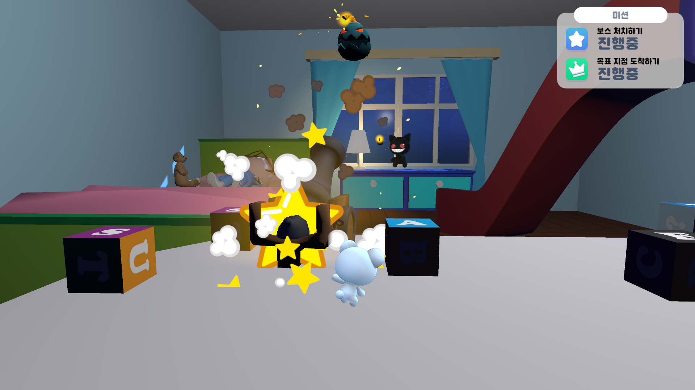
   4. 목표지점
   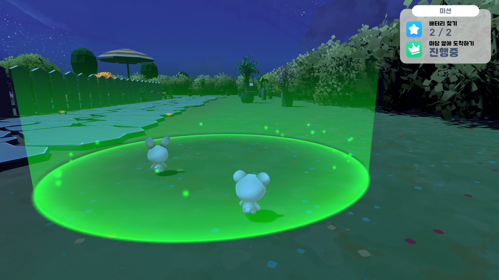

    

7. 게임 클리어
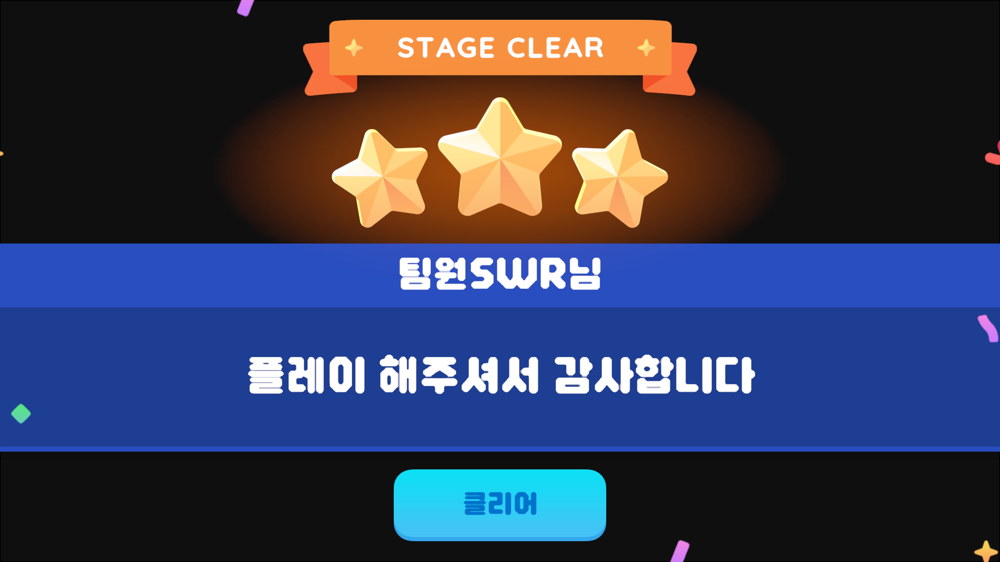